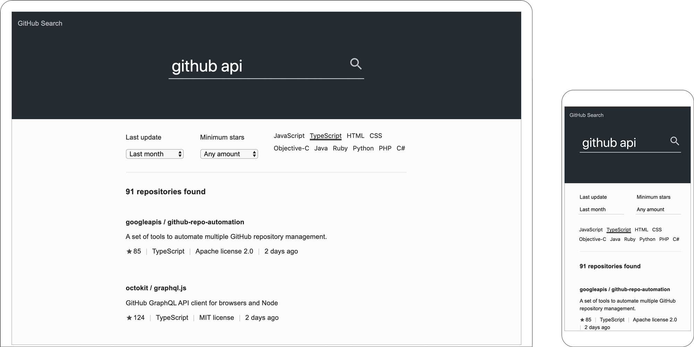

# GitHub Search (Vue.js v2)

[Demo](https://garciaalvaro.github.io/github-search-vue-v2)

This project is a simple app that provides a UI to search GitHub repositories using the [GitHub Search API](https://developer.github.com/v3/search).

There is also a implementation using [React](https://github.com/garciaalvaro/github-react), and another one using [Web Components](https://github.com/garciaalvaro/github-search).

- Built in **TypeScript** using **Vue.js**
- It provides a server using **Node.js** and **Express** on port 4000
- The CSS is built using **Stylus**
- The **Webpack** bundler transforms the files and transpiles them using Babel, and other loaders and plugins
- Code is linted using **eslint** and **prettier** for code format

---

## Getting Started

### Installation

From the root directory inside your terminal run `$ npm install`

### Development

To start Webpack in watch mode and start the development server run `$ npm start`
Once it is ready visit http://localhost:4000 in your browser

### Production

First build the production bundle `$ npm run build`
Once finished, start the production server `$ npm run serve`
To stop the production server run `$ npm run serve:stop`

---

## Docker

The project also comes with Docker configuration files, so it can be run using Docker. It uses the production version of the app. First it builds the scripts with Webpack, then it starts the pm2 server.
- First make sure you have Docker installed
- Run the command `$ npm run docker` which will download and install the dependencies and set up the container
- Once finished, it will be available in http://localhost:4000
- To stop the container run the command: `$ npm run docker:stop`
- If the container needs to be built again, run the command `$ npm run docker:recreate`

---

## Screenshots

